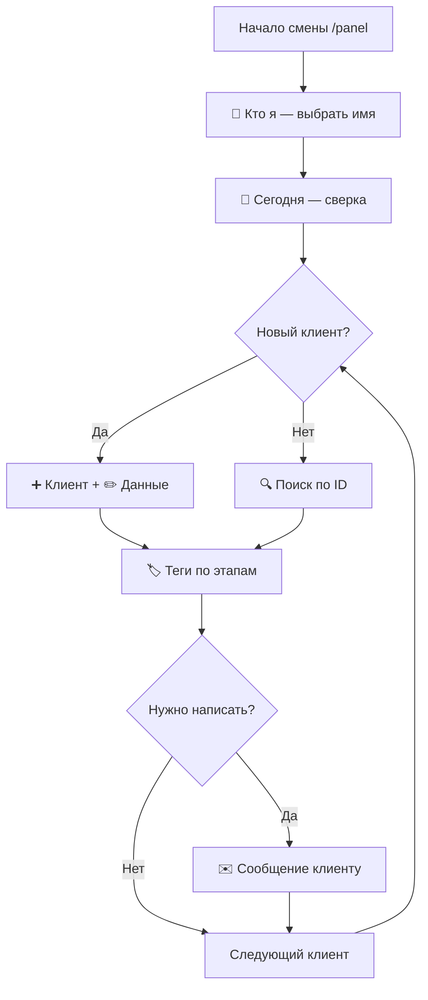

# Uztronix CRM — инструкция для операторов

Полное руководство по работе с Telegram-ботом. Всё управление — **кнопками**, команды нужны редко.

---

## 1. С чего начать

### 1.1. Доступ

Чтобы работать как оператор, администратор должен добавить **ваш Telegram ID** в список операторов (кнопка **➕ Добавить по Telegram ID** в панели админа).

**Имя на смене** вы задаёте сами: **👤 Кто я / сменить** — админ имя не вводит.

Без добавленного Telegram ID панель оператора **не откроется**.

### 1.2. Открыть панель

| Действие | Как |
|----------|-----|
| Открыть Telegram-панель | `/panel` или `/operator` |
| Открыть веб-панель | Кнопка Mini App в меню бота → секретный номер |
| Отменить текущее действие | `/cancel` |
| Справка | `/help` или кнопка **ℹ️ Помощь** |

> `/start` не отправляет сообщений. Веб-панель откроется только при совпадении секретного номера **и** Telegram ID из списка операторов/администраторов.

### 1.3. Две роли в системе

| Роль | Кто это |
|------|---------|
| **Клиент** | Человек, которого вы вносите в CRM (телефон, ID, данные, теги) |
| **Оператор** | Вы — тот, кто ведёт клиента |

**Правило:** клиент закрепляется за **именем оператора**, которое вы указываете при добавлении.  
Вы видите **только своих** клиентов. Чужих клиентов других операторов — нет.

### 1.4. Несколько операторов на одном Telegram-аккаунте

Если с одного телефона работают несколько человек (общий рабочий аккаунт):

1. В начале смены нажмите **👤 Кто я / сменить** и выберите своё имя.
2. При добавлении клиента (**➕ Клиент**) после телефона бот спросит **кто ведёт клиента**:
   - нажмите кнопку с уже введённым именем;
   - или **✏️ Другое имя** и введите новое.
3. Имя сохраняется — в следующий раз его можно выбрать кнопкой.
4. В шапке панели отображается: **Сейчас: Ваше имя**.

> Без выбранного имени список «Мои клиенты» не откроется — сначала укажите, кто работает.

---

## 2. Панель оператора — кнопки

```
┌─────────────────────────────────────────┐
│  👤 Мои клиенты    │  ➕ Клиент         │
│  🔍 Поиск по ID    │  🏷 Теги           │
│  📅 Сегодня        │  ✉️ Сообщение      │
│  👤 Кто я / сменить│  🏷 Справочник     │
│  ℹ️ Помощь         │                    │
└─────────────────────────────────────────┘
```

| Кнопка | Что делает |
|--------|------------|
| **👤 Мои клиенты** | Список всех ваших клиентов с ID, именем и тегами |
| **➕ Клиент** | Добавить нового клиента: телефон → имя оператора |
| **👤 Кто я / сменить** | Выбрать или сменить имя оператора на этом аккаунте |
| **🔍 Поиск по ID** | Найти клиента по номеру `1`, `2`, `3`… или по телефону `+998...` |
| **🏷 Теги** | Выбрать клиента → назначить тег |
| **📅 Сегодня** | Сводка: кого добавили сегодня (имя, ID, телефон, оператор) |
| **✉️ Сообщение клиенту** | Отправить **одному** клиенту сообщение от имени бота (по ID) |
| **🏷 Справочник тегов** | Список доступных тегов + добавить свой тег |
| **ℹ️ Помощь** | Краткая справка |

---

## 3. ID клиента

Каждому новому клиенту автоматически присваивается номер:

```
1, 2, 3, 4, …
```

Используйте его везде:

- в поиске: введите `5`
- в списках: `#5`
- при сообщении клиенту: сначала ID, потом текст

Телефон — в формате Узбекистана: `+998901234567`.

---

## 4. Работа с клиентом

### 4.1. Добавить клиента

1. **➕ Клиент**
2. Введите телефон: `+998901234567`
3. Укажите **имя оператора** (кнопкой или вводом текста)
4. Бот выдаст **ID** (например `12`) и откроет карточку

Клиент закрепляется за указанным именем оператора.

### 4.2. Найти клиента

**🔍 Поиск по ID** → введите:

- `7` — поиск по ID
- `+998901234567` — поиск по телефону

Откроется **карточка клиента**.

### 4.3. Карточка клиента

После поиска или добавления доступны кнопки:

| Кнопка | Действие |
|--------|----------|
| **✏️ Данные** | Изменить поля клиента (см. ниже) |
| **🏷 Теги** | Назначить или посмотреть теги |
| **📎 Фото тегов** | Просмотр фото, прикреплённых к тегам |
| **✉️ Написать** | Сообщение этому клиенту в Telegram |
| **◀️ Панель** | Вернуться в главное меню |

### 4.4. Заполнить данные клиента (Mini App)

**✏️ Данные** → выберите поле → введите значение:

| Поле | Что видит клиент в Mini App |
|------|----------------------------|
| Имя / ФИО | Имя в кабинете |
| Должность | Должность |
| Отдел | Отдел |
| Стаж | Стаж |
| ID кабинета | Внутренний номер сотрудника |
| Аванс (сум) | Баланс аванса |

Данные сохраняются сразу. Клиент увидит их после входа в Mini App.

---

## 5. Теги — действия клиента

Тег = **действие**, которое сделал клиент (паспорт, договор, в работе и т.д.).

### 5.1. Общие и личные теги

| Тип | Кто видит | Примеры |
|-----|-----------|---------|
| **Общие (первые 3)** | Все операторы | Паспорт получен, Договор подписан, В работе |
| **Ваши** | Только вы | Теги, которые вы сами создали |
| **От админа** | Все операторы | Теги, добавленные администратором |

Создать свой тег: **🏷 Справочник тегов** → **➕ Добавить тег** → введите название.

### 5.2. Назначить тег

1. **🏷 Теги** (или **🏷 Теги** в карточке клиента)
2. Выберите клиента из списка
3. Нажмите **`+ Название тега`**
4. На этом шаге можно:

| Вариант | Как |
|---------|-----|
| Только тег | Кнопка **✓ Без вложений** или команда `/skip` |
| Текст | Напишите комментарий (например «паспорт на проверке») |
| Фото | Отправьте изображение |
| Текст + фото | Отправьте фото с подписью |

5. **✕ Отмена** или `/cancel` — отменить без сохранения

> Если нажали другую кнопку панели — незавершённое действие сбрасывается, бот не будет «висеть» в ожидании.

### 5.3. Просмотр тега

Если тег уже стоит (галочка **✓**):

- нажмите на него → **📎 Смотреть фото** / **📝 Текст заметки**
- **✕ Снять тег** — убрать тег с клиента

---

## 6. Сообщение клиенту

Оператор может писать **только одному** клиенту за раз.

### Способ 1 — из панели

1. **✉️ Сообщение клиенту**
2. Введите ID: `3`
3. Введите текст сообщения
4. Бот отправит его клиенту **от своего имени**

### Способ 2 — из карточки

1. Откройте карточку клиента
2. **✉️ Написать**
3. Введите текст

> Сообщение дойдёт только если клиент **хотя бы раз** открывал бота / Mini App. Иначе бот сообщит, что отправить нельзя.

---

## 7. Сводка за сегодня

**📅 Сегодня** — список клиентов, добавленных **сегодня**:

```
Имя — #ID — телефон
Оператор: кто добавил
```

Удобно для утренней/вечерней сверки.

---

## 8. Типовые сценарии (шпаргалка)

### Новый лид с нуля

```
👤 Кто я / сменить → ваше имя
➕ Клиент → телефон → имя оператора → ✏️ Данные (имя) → 🏷 Теги → «В работе» → Без вложений
```

### Клиент прислал паспорт

```
🔍 Поиск → ID → 🏷 Теги → «Паспорт получен» → отправить фото паспорта
```

### Клиент подписал договор

```
🔍 Поиск → ID → 🏷 Теги → «Договор подписан» → фото договора + подпись
```

### Напомнить клиенту

```
🔍 Поиск → ID → ✉️ Написать → текст напоминания
```

---

## 9. Что оператору недоступно

| Функция | Кто может |
|---------|-----------|
| Полный Excel-отчёт | Только админ |
| Сводка по всем операторам | Только админ |
| Рассылка всем клиентам | Только админ (с подтверждением) |
| Добавление/удаление операторов и админов | Только админ |
| Просмотр чужих клиентов | Никто (кроме админа) |

---

## 10. Roadmap — рабочий процесс оператора

### Ежедневный цикл



### Этапы ведения клиента (воронка)

| Этап | Тег | Что делать |
|------|-----|------------|
| 1 | **В работе** | Клиент добавлен, идёт первичный контакт |
| 2 | **Паспорт получен** | Клиент прислал документ → прикрепить фото |
| 3 | **Договор подписан** | Договор подписан → прикрепить фото/скан |
| 4 | Свои теги | Любые доп. этапы, которые вы создали под свой процесс |

### Рекомендации

1. **Всегда заполняйте имя** сразу после добавления — так проще искать в списке.
2. **Используйте ID** в переписке с коллегами («клиент #15»), а не только телефон.
3. **К тегам прикрепляйте фото**, когда это важно (паспорт, договор) — админ сможет проверить.
4. **Не оставляйте незавершённые действия** — если передумали, жмите **✕ Отмена** или `/cancel`.
5. **Сообщения клиенту** — только по делу; клиент видит их как сообщения от бота Uztronix.

---

## 11. Roadmap — развитие системы

### ✅ Сейчас (реализовано)

- Панель оператора с кнопками
- ID клиентов `1, 2, 3…`
- Поиск по ID и телефону
- Теги с текстом и/или фото
- Общие + личные теги
- Редактирование данных для Mini App
- Сообщение одному клиенту по ID
- Сводка за сегодня
- Разделение доступа: только свои клиенты
- Общий Telegram-аккаунт: имя оператора при добавлении + быстрый выбор

### 🔜 Ближайшие улучшения

- Уведомления оператору при действиях клиента в Mini App
- Быстрый поиск по имени (не только ID)
- Шаблоны сообщений для рассылки клиенту
- История переписки с клиентом в карточке

### 📋 Планируется

- Статистика по вашим тегам и конверсии
- Напоминания «клиент без тега N дней»
- Интеграция с Google Sheets для оператора (read-only)
- Мобильные push при новом лиде

---

## 12. Частые вопросы

**Панель не открывается (`/panel`)?**  
Убедитесь, что админ привязал ваш Telegram ID к записи оператора.

**Не вижу клиента другого оператора?**  
Так и задумано — вы видите только своих. Проверьте **👤 Кто я / сменить**: возможно, выбрано чужое имя.

**Несколько человек с одного Telegram?**  
Каждый в начале смены выбирает своё имя. При добавлении клиента имя оператора обязательно.

**Кнопка «Без вложений» не видна?**  
Обновите бота (`/start`) и повторите. Кнопка появляется сразу после выбора тега.

**Клиент не получил сообщение?**  
Он должен хотя бы раз открыть бота или Mini App. Попросите клиента нажать `/start` в боте.

**Как узнать свой Telegram ID?**  
Напишите боту [@userinfobot](https://t.me/userinfobot) или попросите админа.

---

## 13. Команды (запасной вариант)

Основная работа — **кнопками**. Команды на случай, если удобнее:

| Команда | Действие |
|---------|----------|
| `/panel` | Панель оператора |
| `/cancel` | Отмена текущего действия |
| `/skip` | Тег без вложений (вместо кнопки) |
| `/help` | Справка |
| `/add +998...` | Добавить клиента (как кнопка ➕) |
| `/employees` | Список моих клиентов |

---

*Uztronix Holding CRM · актуально на версию main*
